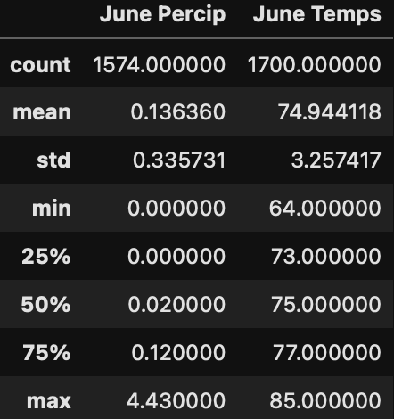
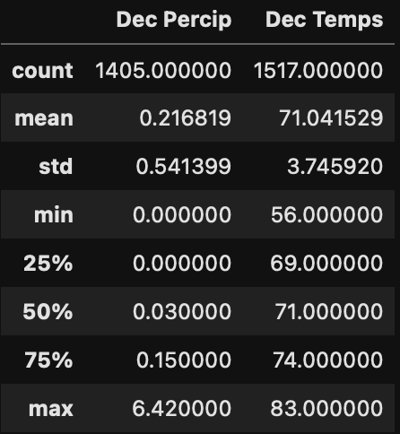

# Surfs Up! SQLalchemy Analysis

## Overview of the statistical analysis
This analysis was meant to assist an entreprenuer in opening his own surf and ice cream shop in Oahu, Hawaii. He is interested in what the temperature and percipitation levels are for the months of June and December, to determine if the weather best support surfing and/or ice cream.

Using Jupyter Notebook, for python coding, SQLalchemy was utilized in order to query from a SQLite file. The query allowed for specific filtering to be done on the data being pulled in, such that a dataframe just for June weather and a dataframe just for December weather could be created.

Descriptive analysis was then run on the June and December dataframes, to see the average, minimum, and maximum temperature and percipitation ranges look like.

## Results

| June | December |
| ------------ | ------------- |
| |  |

For the June data:
* Average percipitation is low, at 0.1 inch of rainfall. With the maximum being less than 4.5 inches. 
* Average temperatures are pleasant, at 75 degrees. With the maximum being 85 degrees and minimum being 64 degrees.

For the December data:
* Average percipitation is still low, but a little higher than in June at 0.2 inches. However, the maximum possible rain fall is nearly 2 inches more than in June, at 6.4 inches. 
* Average temperatures are a little lower than June, at 71 degrees. With the max being 83 degrees, but the minimum has the possibility of getting down to 56 degrees. 

## Summary

The two months are fairly similar when it comes to the averages, with December being slighly wetter and colder than June. However, the larger differences come in the variances between the minimum and maximums within temperature and percipitation between the two months. December has a much larger amount of percipication, and a much lower temperature as compared to June. 

It appears that June would be the best month overall, when comparing just June to December, in terms of optimal weather for surfing and ice cream. However, December still seems like a decent month for surfing and ice cream, as long as that month errs on the average to maximum side of weather patterns.

Another query that can be done, in order to find the optimal months for surfing and ice cream, would be to run queries for every month of the year, and then plot each month's average percipitation and temperature.
